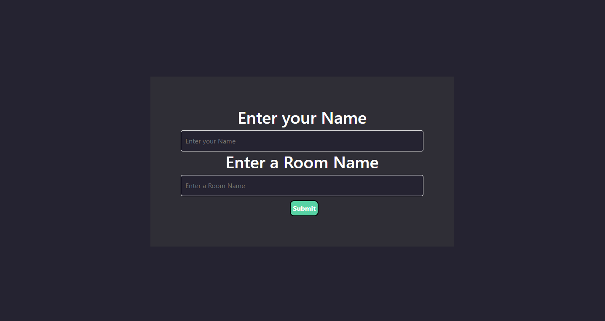
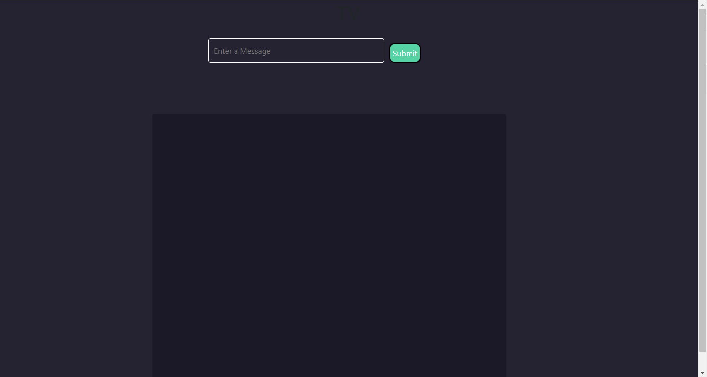
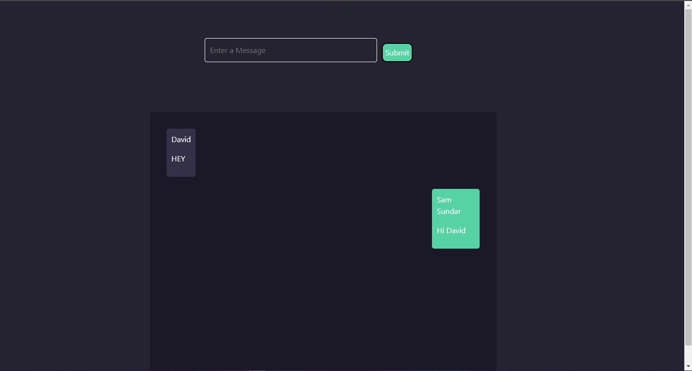

# Django Chat
### Tools Used
* HTML/CSS
* JavaScript
* Django 
* Django Channels


### How to Run this Project
``` bash
cd path/to/project
virtualenv env
env\scripts\activate

python manage.py runserver
```

### ScreenShots



